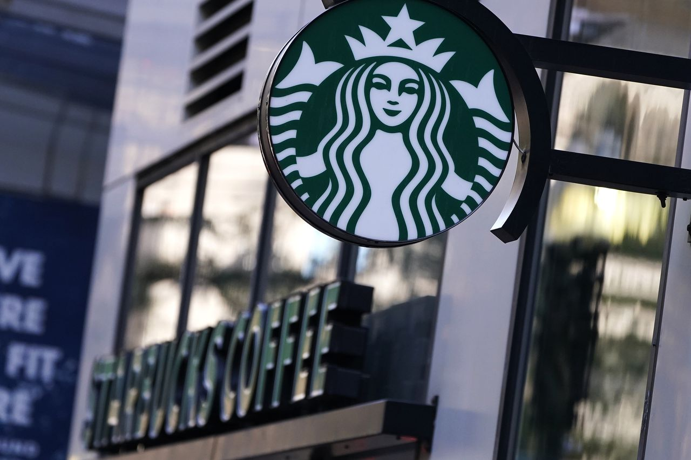

# Starbucks Offers Analysis
## by (Wael Saleh Alomayrah)

## Introduction
This data set contains simulated data that mimics customer behaviour on the Starbucks rewards mobile app. Once every few days, Starbucks sends out an offer to users of the mobile app. An offer can be merely an advertisement for a drink or an actual offer such as a discount or BOGO (buy one get one free). Some users might not receive any offers during certain weeks.
## Problem Statement
The goal of this project is to see how different demographic groups react to the offers and to try to predict whether or not a customer who received the offer will complete it.
Before passing the data to the models:
Data should be preprocessed and prepared.
Numerical attributes should be normalized.
Categorical attributes should be encoded.
Then, passing the data to several supervised learning classification models.
and finally assessing the models and determining what is the best for this dataset.

## Data Sets
The data is contained in three files:
portfolio.json — containing offer ids and metadata about each offer (duration, type, etc.)
profile.json — demographic data for each customer
transcript.json — records for transactions, offers received, offers viewed, and offers completed

## Classification models used
1. Decision Tree classifier
2. Random Forest classifier
3. Gradient Boosting classifier
4. Naive Bayes classifier
5. K-Nearest Neighbours classifier
6. Logistic Regression classifier
7. SVM classifier

### for further details visit this [blog](https://medium.com/@wayle1419/starbucks-offers-prediction-b1cbbdacddd1) 

